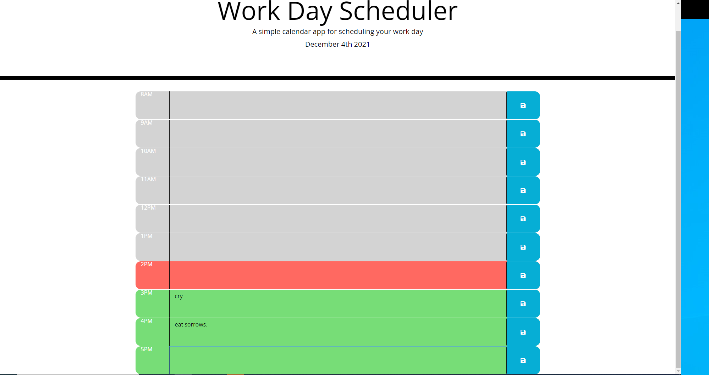

# Work Day Scheduler Using Third Party APIs

This website is a simple calendar application that allows users to add events on day calendar. The calendar displays hour blocks from the hours of 8 AM to 5 PM and utilizes
CSS to store the current hour of the current day in red, any hour prior to the current hour in grey, and any future hour in green. The website utilizes the moment.js library to
store the current date and time at the top of the screen and javascript to compare that to other hour blocks throughout the day. 

